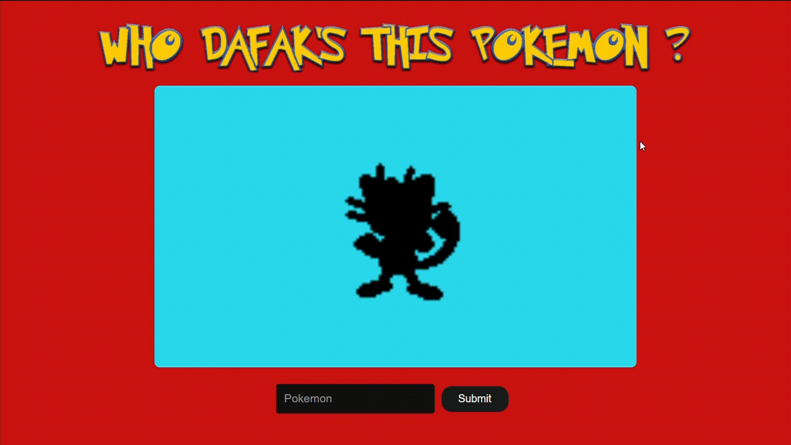

<h1 align="center">
  

    Whotf's this pokemon ?
  

</h1>

## Quick story short
I just wanted to test my javascript real quick so a i gotten the idea to make my on version of "who's this pokemon", so i used the pokeAPI to get the pokemon data and implemented on an html page, feel free to try it out.

## How to test it
just open the html file on your browser and have fun :)